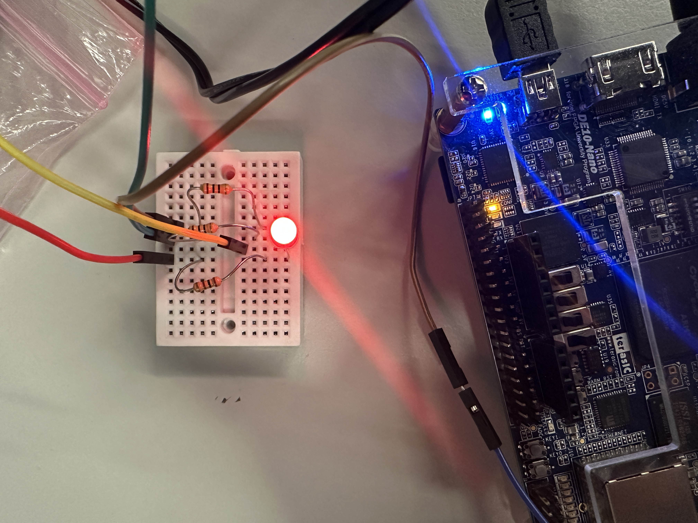
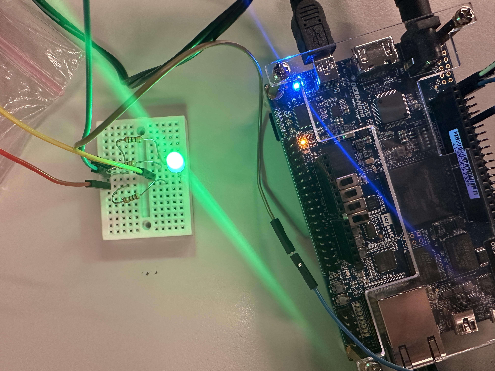
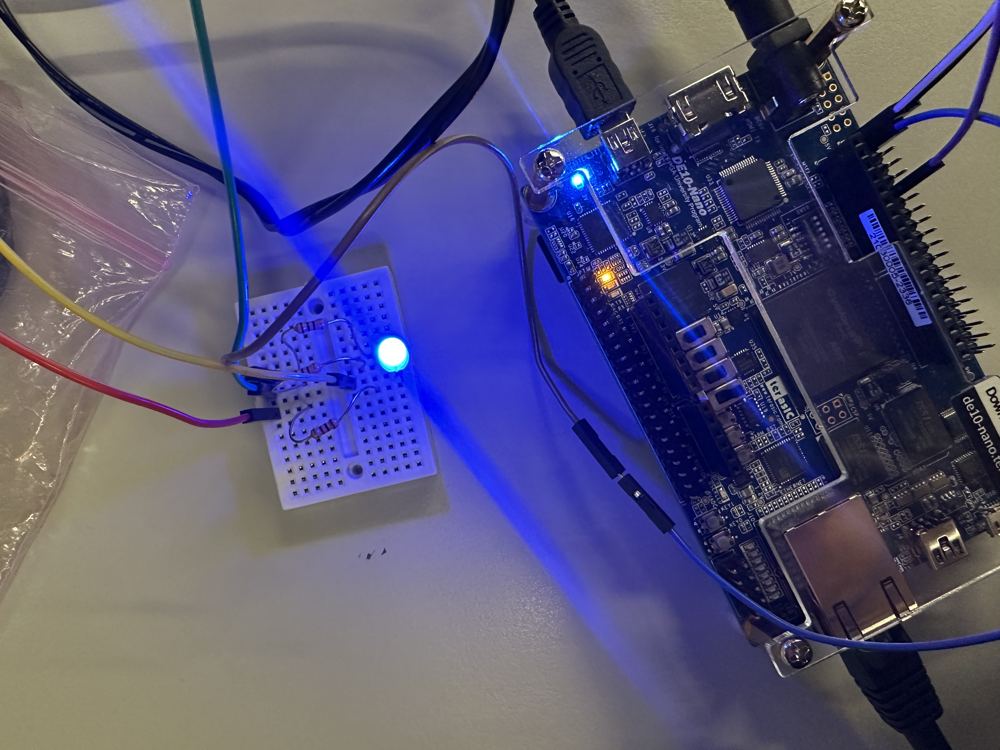
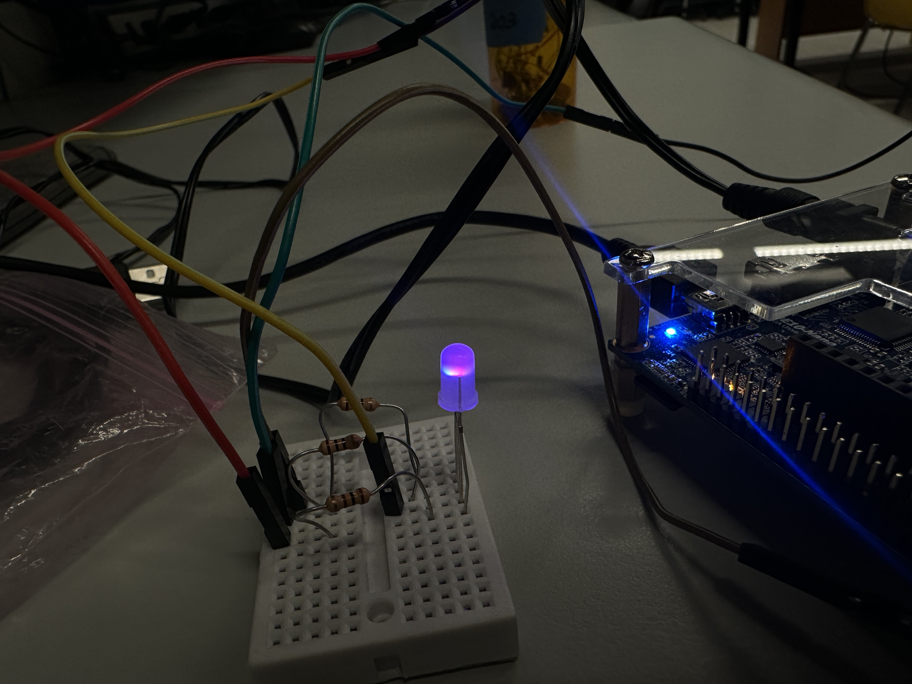

# Homework 10: RGB LED Controller VHDL

## Overview
In this assignment, you’ll create an RGB LED controller using the PWM controller you created in HW 8.
Controlling an RGB LED is part of your final project.

## Deliverables
<Red LED>
Here is the image of the LED set to just RED.

<Green LED>
Here is the image of the LED set to just GREEN.

<Blue LED>
Here is the image of the LED set to just BLUE.

<Fun LED>
Here is the image of the LED set to a fun color. With a red value of 0xFF, the green is set to 0xA5, and blue is set to 0xFF.

The calculations that were done for the resistors are: 

$R = (3.3-2)/(0.002)$ This is for the red LED, that has a forward voltage of 2v.

$R = (3.3-3)/(0.002)$ This is the calculation for the green and blue LEDs, that have a forward voltage of 3v.

The resistors that were chosen from the resistors I had in my stock, was a 100ohm resistor for the red LED, and 10 ohm resistors for the blue and green LEDs. 

## Questions
There were no questions for this homework.
