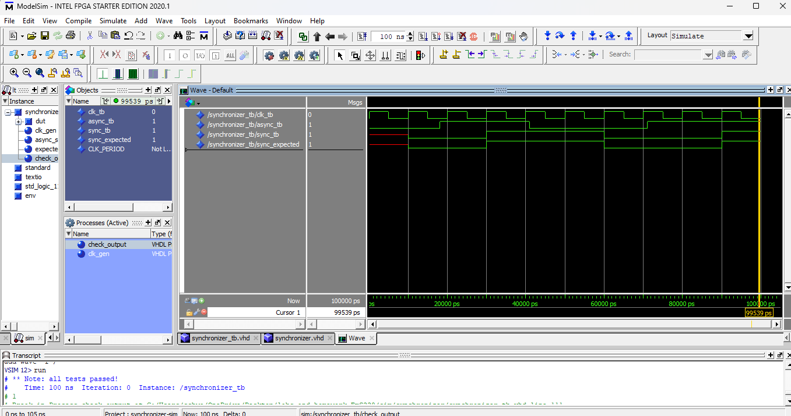

# Homework 3 Synchronizer

## Overview
In this homework we built a simulated synchronizer. We used two D-flip-flops in Quartus simulation IDE. I used ModelSim in order to fulfill this project. Then we used a testbench that was provided to us in order to simulate what this would look like in hardware. 

## Deliverables
<Simulation Window>

## Questions
No questions for this project.