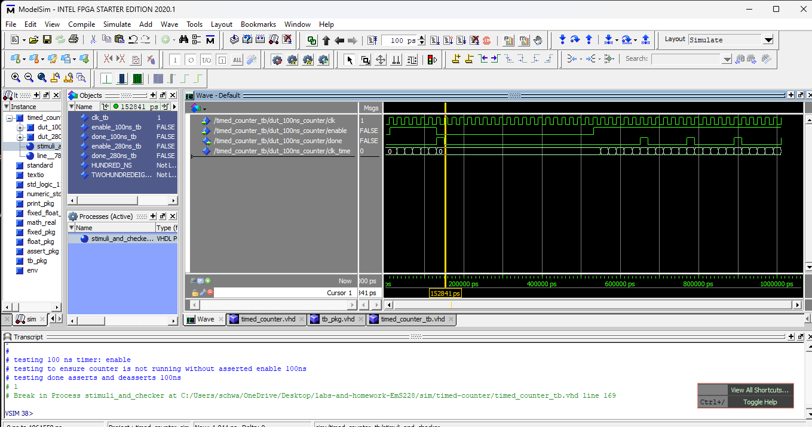
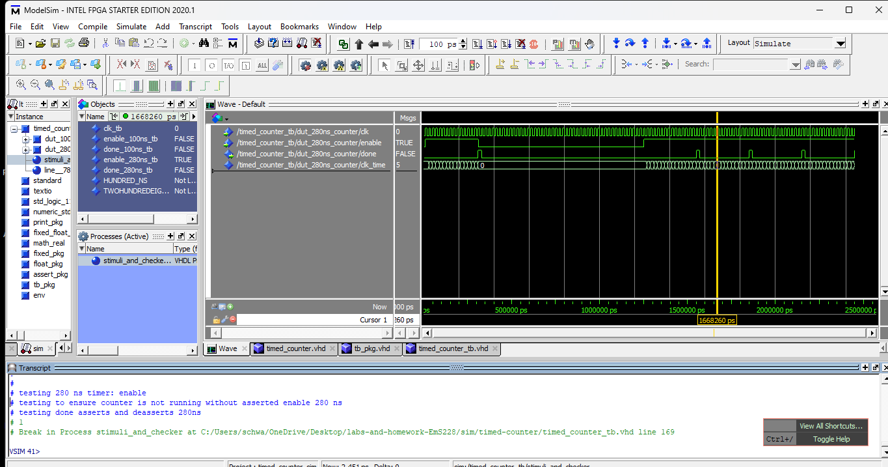

# Homework 4: Timed Counter VHDL

## Overview
In this homework we built a "timed counter" component. This counter counts from a specified time and one it has reached that time a done signal is asserted.

## Deliverables
<100ns Waveform Window>
<280ns Waveform Window>

## Questions
No Questions for this homework
