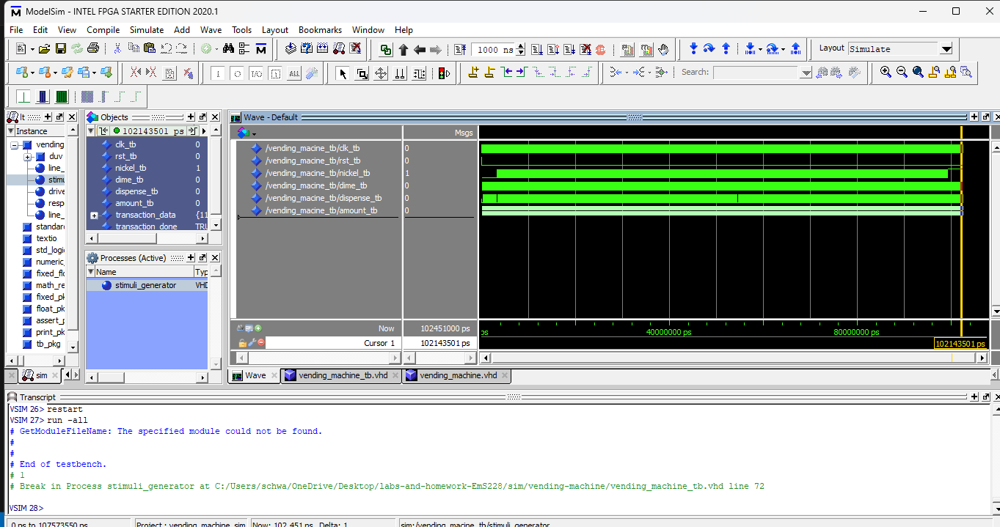

# Homework 5: Vending Machine VHDL

## Overview
In this homework we built a vending machine finite state machine. We had 4 states to work with. I used a 3 process state machine. The 4 states were; when there are no coins, when there is 5 cents, when there is 10 cents, and when there is 15 cents. Each of these states could have a nickel or dime inputted into the machine. We also needed to catch if both coins were put in at the same time. If this instance was raised then the larger coin was accepted. 

## Deliverables
<Waveform Screenshot>

## Questions
No Questions for this homework
