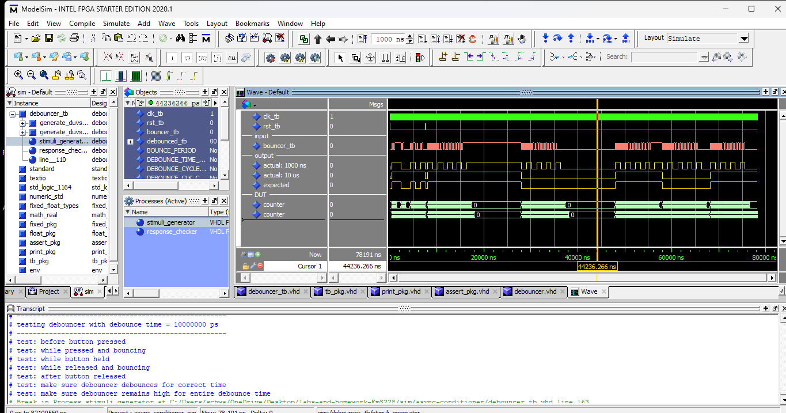
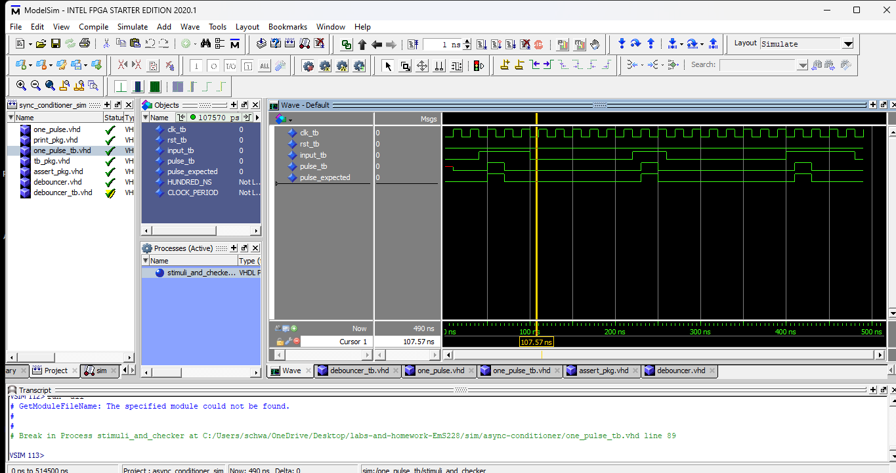
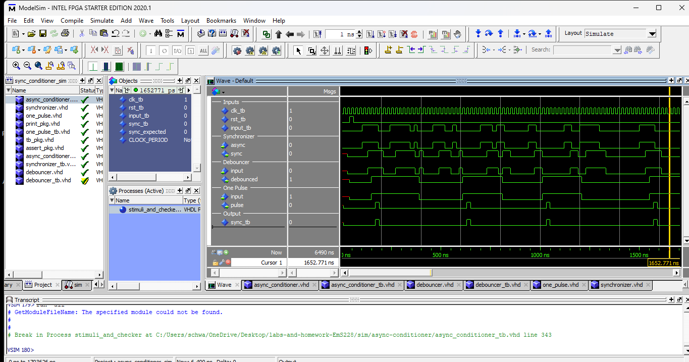
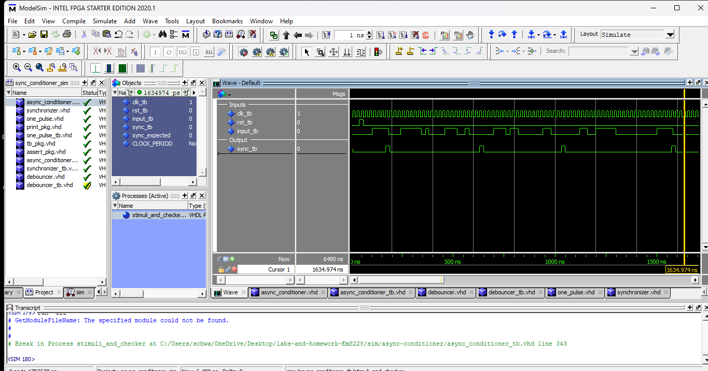

# Homework 6: Async Conditioner

## Overview
In this homework we used the previously made synchronizer, and make a file that keeps the button from triggering multiple times when the button is bouncing, and also only triggers for one clock pulse. Then all three of these components are put into one vhdl file in order to work as one asynchronus conditioner.

## Deliverables
### Debouncer
<Debouncer Screenshot>

### One Pulse
<One Pulse Screenshot>

### Async Conditioner
<Async Conditioner Complicated>
In this image you can see the chain of events leading to the output being synchronized, debounced, and one single pulse. It starts with the input and then shifts to the syncronizer section and shifts it to be synchronized. Then after it has been synchronized it shifts to the debouncer section. After it is debounced it shifts down to the one pulse section. After it has completed this the value is consistent with the output. You can follow the button press all the way down to the output.
<Async Conditioner Clean>
In this image there is a cleaner view of the output from the input. 

## Questions
No questions for this homework.
