# Homework 7: Linux CLI Practice

## Overview
Many Linux CLI tools were born out of and influenced by the Unix Philosophy, which has been summarized
as follows1:
+ Write programs that do one thing and do it well.
+ Write programs to work together.
+ Write programs to handle text streams, because that is a universal interface.

In short, the Unix Philosophy is all about modularity and composability. Unix tools are small and only
do one thing, but they can easily be combined to handle complex tasks (often through the use of pipes).
William E. Shots gives an example of how simple and powerful the CLI can be2:
Why do you need to learn the command line anyway? Well, let me tell you a story. Many years
ago we had a problem where I worked. There was a shared drive on one of our file servers that
kept getting full. I won’t mention that this legacy operating system did not support user quo-
tas; that’s another story. But the server kept getting full and it stopped people from working.
One of our software engineers spent a couple of hours writing a C++ program that would look
through all the user’s directories and add up the space they were using and make a listing of
the results. Since I was forced to use the legacy OS while I was on the job, I installed a Linux-
like command line environment for it. When I heard about the problem, I realized I could
perform this task with this single line:
du -s * | sort -nr > \$HOME/user_space_report.txt
This assignment will give you practice with some common Linux CLI tools as well as chaining multiple
commands together. 

For each problem in this assignment, you’ll document the input (your command)
and the output in your markdown submission file:
1. Write the command you used.
2. Insert a screenshot of the output in your terminal window.

## Counting
The following problems use the wc (word count) command.
### Problem 1:
I used the **`wc lorem-ipsum.txt -w`** command. 
<Prob1>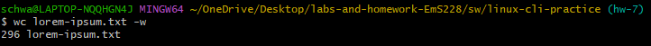

### Problem 2:
I used the **`wc lorem-ipsum.txt -m`** command. 
<Prob2>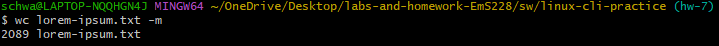

### Problem 3:
I used the **`wc lorem-ipsum.txt -l`** command. 
<Prob3>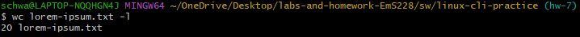

## Sorting
The following problems use the sort command.
### Problem 4:
I used the **`sort file-sizes.txt -h`** command. 

<Prob4>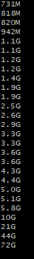

The transition from the last couple of file sizes is seen in the image. This is due to the output being too large to fit on one screenshot. 

### Problem 5:
I used the **`sort file-sizes.txt -h -r`** command. 

<Prob4>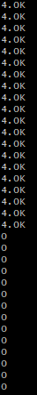

The transition from the last couple of file sizes is seen in the image. This is due to the output being too large to fit on one screenshot. 

## Cutting
The following problems use the cut command, which is used to select parts or fields from a text file (e.g.,
select the second column from a csv file).
### Problem 6:
I used the **`cut log.csv -d',' -f3`** command. 
<Prob6>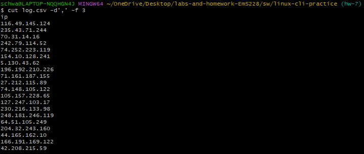

### Problem 7:
I used the **`cut log.csv -d',' -f2-3`** command. 
<Prob7>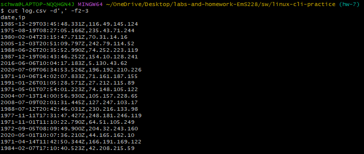

### Problem 8:
I used the **`cut log.csv -d',' -f1,4`** command. 
<Prob8>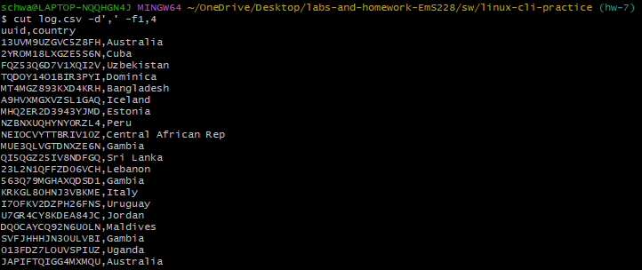

## Heads or Tails
**head** can be used to print out the first part of a file; tail can be used to print out the last part of a file.
### Problem 9:
I used the **`head gibberish.txt -n3`** command.
<Prob9>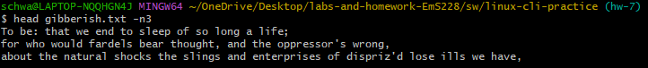

### Problem 10:
I used the **`tail gibberish.txt -n2`** command.
<Prob10>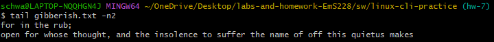

### Problem 11:
I used the **`tail log.csv -n20`** command.
<Prob11>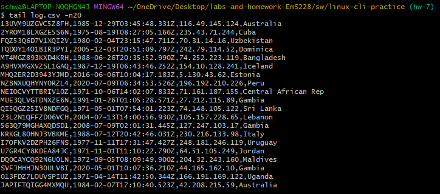

## Searching for Patterns
Regular Expressions are a way to search for patterns in a string of text. Regular expressions can be very
powerful and useful. For example, we can use a regular expression to find particular error messages in
the Linux kernel’s log (dmesg).
If you are not familiar with regular expressions, please see the following resources:
+ Regular expression tutorial 
+ Regex cheatsheet
grep is the primary tool for searching text with regular expressions. grep stands for “Global Regular Ex-
pression search and Print”. Check out grep’s help text and man page for more information; there is a Linux
Journey grep tutorial.
### Problem 12:
I used the **`grep "and" gibberish.txt`** command.
<Prob12>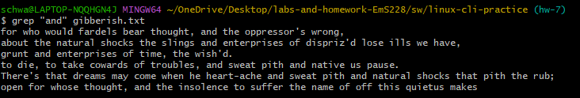

### Problem 13:
I used the **`grep -w "we" gibberish.txt`** command.
<Prob13>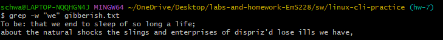

### Problem 14:
I used the **`grep -E "To be|to sleep|to die|to take|to suffer" -o gibberish.txt`** command.
<Prob14>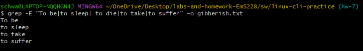

### Problem 15:
I used the **`grep FPGAs -c fpgas.txt`** command.
<Prob15>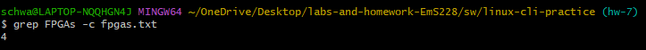

### Problem 16:
I used the **`grep -P ".(ot)|.(ower)|.(ile)" fpgas.txt`** command.
<Prob16>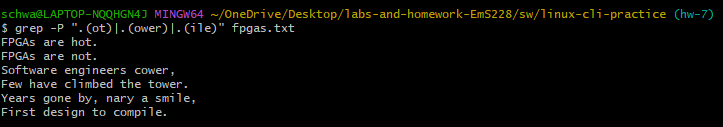

### Problem 17:
I used the **`grep -rl "-" ../../hdl/`** command.
<Prob17>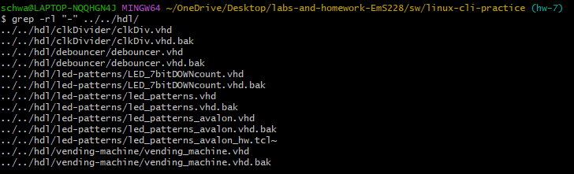

## Redirection
One of the hallmarks of the Linux CLI is redirecting input/output. The most common use cases are redi-
recting output to a log file and piping commands together (covered in the next section.)
### Problem 18
I used the **`ls > ls-output.txt`** command.
<Prob18>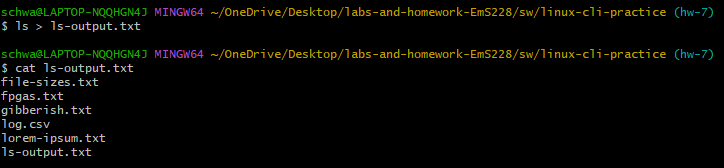

## Composing Commands
Pipes (|) are a way to direct the output of one command to the input of another command. Since Unix tools
are designed to operate on text streams, pipes are a very powerful way to compose commands together.
### Problem 19
I used the **`sudo dmesg|grep "CPU"`** command.
<Prob19>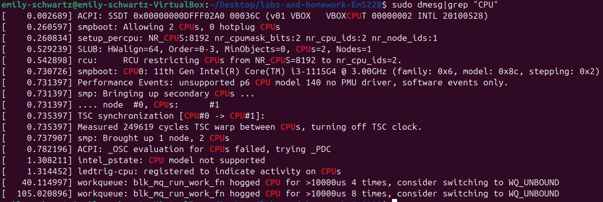

### Problem 20
I used the **`find ../../hdl/ -iname '*.vhd' |wc -l`** command.
<Prob20>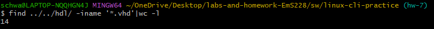

### Problem 21
I used the **`grep -r "-" ../../hdl/|wc -l`** command.
<Prob21>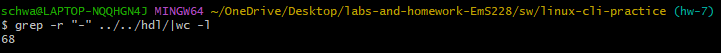

### Problem 22
I used the **`grep FPGAs -n fpgas.txt| cut -d':' -f1`** command.
<Prob22>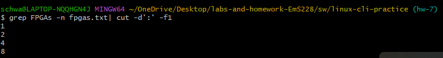

### Problem 23
I used the **`du -h *|sort -h -r|head -n3`** command.
<Prob23>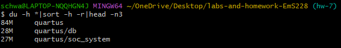
