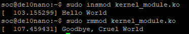
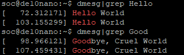
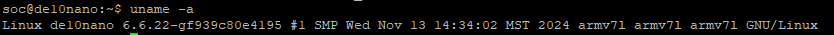
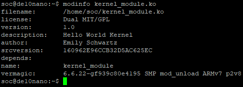

# Homework 8: “Hello World” Linux Kernel Module

## Overview
The goal of this homework is to introduce some basic concepts about Linux kernel modules and learn how
to compile them. You will create a “Hello World” kernel module and use dmesg and grep, two common
Unix utilities, to find debug messages you printed from your kernel module.

## Deliverables
<Hello World Linux>

I was not sure which proof you would like so I added both of the ways to have proper proof. 

<Hello World Linux>

Here is the use of uname. 
<Hello World Uname>

Here is the output of modinfo.
<Hello World modinfo>

## Questions
There were no questions for this homework.