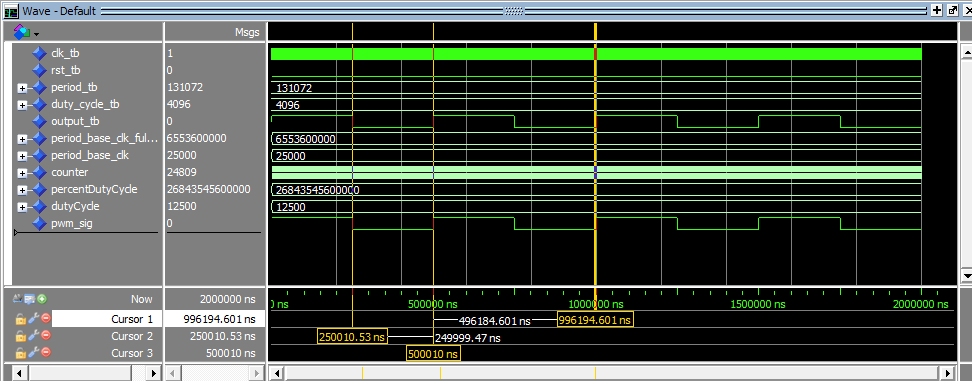
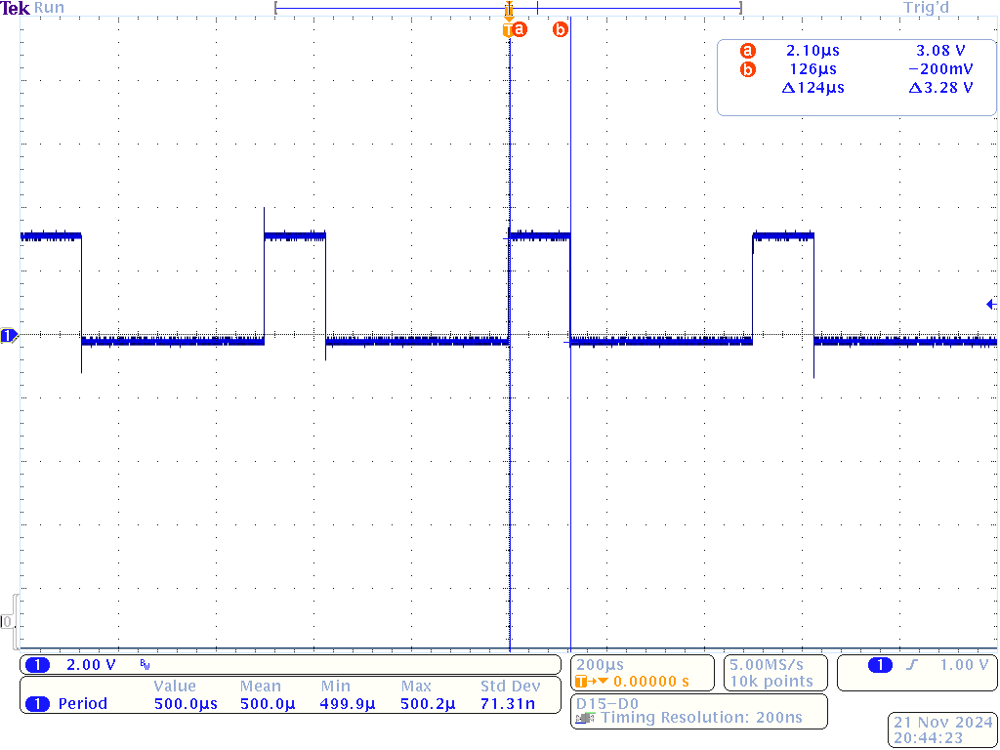

# Homework 9: PWM Controller VHDL

## Overview
A Pulse Width Modulated (PWM) signal is shown below with varying pulse widths. You will be creating a
PWM controller that will be used in your final project to control an RGB LED.

## Deliverables
<PWM Simulation>

For this image the period was set to 50ms, and the duty cycle was set as 50%. As seen in the image the cursor shows a period of 50ms, and a duty cycle of 50%. 

<Hello World Linux>

For this image the period was again set to 50ms, but the duty cycle was set to 25%. 25% of 50ms is 125us. The cursor, due to resolution was not able to get exactly 125us. 

## Questions
There were no questions for this homework.
