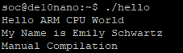

# Lab 3: Developer's Setup

## Overview
In Lab 3, you will configure your environment to allow the DE10-Nano board to
boot from the Ubuntu VM that you created in Lab 1. This is called the Developer’s
Setup since it allows development without having to remove and modify the microSD
card for every little modification. Instead, the DE10-Nano board will boot and use
files served from the Ubuntu VM. This requires setting up two servers. The TFTP
server and the NFS server. See Fig. 11.13 in Sect. 11.1.3 Developer’s Boot Mode
Setup (page 212) on how these servers will be used to allow the DE10-Nano board
to boot over a local network.

## Deliverables
<Hello World>

## Questions
There were no questions for this lab.