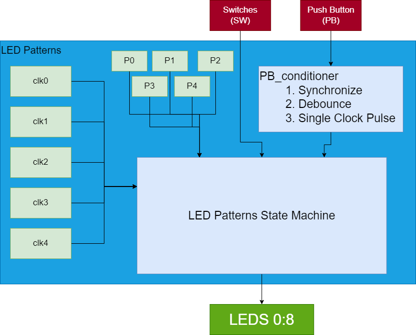

# Labs 4: LED Patterns

##  Overview
In this lab we were tasked with creating a program to set the LEDs to a pattern based on the value, in binary, of the switches. Additionally the pattern speed needs to be based off of a base clock period, and then divided down from there to make the patterns run at different speeds. The pattern should not switch until the button is pressed. Once the button is pressed the switch value needs to be held on the LEDs for one second, then it needs to switch to the pattern. If the value of the switches is larger than 4, the switches value needs to be displayed anf then return back to the previous state. 

### a) Functional Requirements
The functional requirements of this lab are, the hps led control, led 7 needs to blink at the base clock rate, the state machine needs to have five states, and when the push button is pressed the leds need to hold the switches value for 1 second and then transition to the next state. 

The hps led controller is meant to check if the hps controller is enabled. If it is enabled then the leds are controlled by the software of the ARM HPS. If it is not enabled then the leds are controlled by the led patterns component. 

The led 7 needs to blink at the base clock rate, that is manually set in the code. This needs to happen no matter what the switches are set to.

The state machine needs to read in the values from the switches and change the pattern based on the value inputted. Additonally the different patterns are all running at different clock rates. The final state was user defined. In my case I made two LEDS on either half of the array shift outward. All other states were defined by the lab instructions. 

Finally the when the push button is pressed the value of the switches needs to be held for one second, using the timed counter made in a previous assignment. After the timed counter is finished the state needs to transition to the next state, of the switches. Additionally if the value of the switches is larger than the binary value four then the value still needs to be shown on the leds for 1 second and then transition back to the previous state that was running. 

## System Architecture

### Block Diagram
<Block Diagram>
The architecture of the system all flows into the LED patterns state machine. The switches feed directly into the state machine to be evaluated. The push button goes through the asynchronous conditioner in order to synchronize the button, debounce, and make the signal into a single clock pulse. From that component the signal of the clock goes into the state machine. 

Each pattern, P0-P4, is a different component that feeds into the state machine. The clocks for each component is fed into the patterns through the led patterns file. 

All of the clocks are generated in the same component and then sent to the state machine to be assigned to the different led patterns. 

### State Machine
<State Diagram>

As can be seen in the image the transition of the states is dependant on both the switches and the push button. The only way to get to the next state is by pressing the button and triggering the wait state. From the wait state the next pattern can be triggered and started. The machine stays in the state it is currently in, as long as it is not in the wait state, until the button is pressed again.

## Implementation Details
The user defined led pattern was implmented by shifting the upper half of the leds and the lower half of the leds, outwards. Unfortunately since there is an uneven number of leds to use the pattern is less satisfing than it was expected to be. The pattern begins with two lit leds in the center of the array. As the clock triggers, each leds rotates outwards, until it rolls over and goes back to the center. This pattern is running at 4 times the base clock rate. This makes this pattern very slow. 

