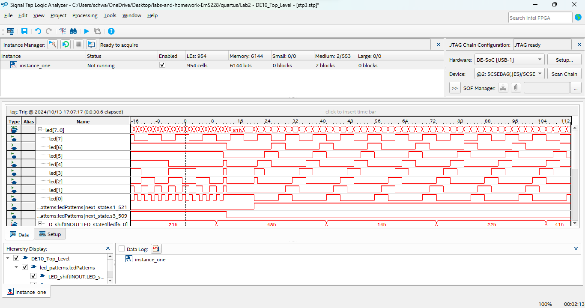
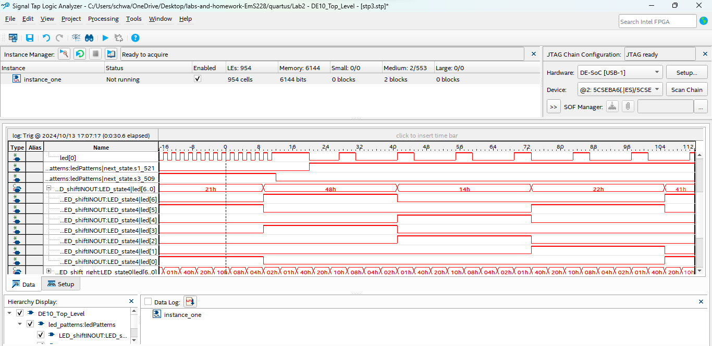
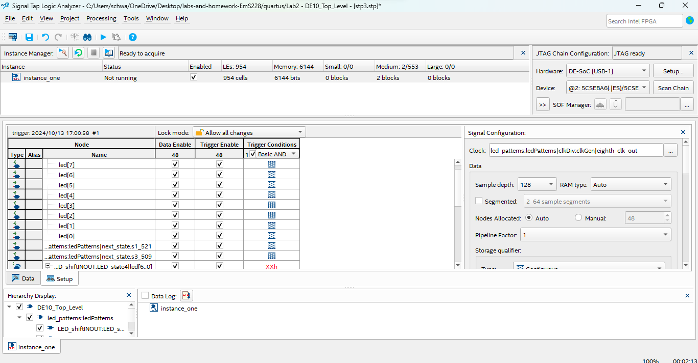

# Lab 5: Signal Tap

## Overview
Signal Tap is an embedded logic analyzer tool in Quartus that you can use to debug
your FPGA designs while they run at speed in the FPGA fabric. If you compile your
VHDL, download the bit stream into the FPGA and then find that it is not working
correctly; how do you see what is going on inside the FPGA? You can see what is
going on with your signals by using Signal Tap. We will use Signal Tap in this lab
to probe your design from Lab 4.

## Deliverables
<State Switch>
Here is a screenshot of the signal tap analyzing the switch of one state to the next from the button press.

<User Defined Pattern>
This is the screenshot of the user defined led pattern. This pattern is two shifting leds. They both shift out from the middle. Since there is an odd number of leds for the user to control, eventually they are not synched in their movements. 

<Signal Depth>
This is the image that displays the sample depth from the signal configuration pane. 

## Questions

> How much FPGA on-chip memory was required
to monitor your signals?

The amount of memory that was required to monitor the signals was 6144 bits. This can be seen in the screenshots. 

.
