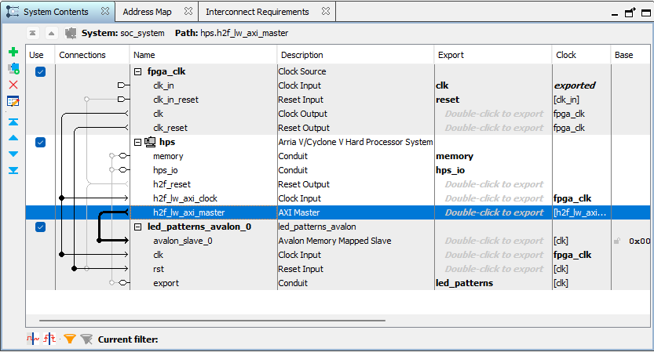

# Lab 6: Creating a Custom Component in Platform Designer

## Overveiw 
Now that we’ve created our LED patterns hardware, we’re going to start working towards being able to
control our hardware from software. The first step is to create registers that software will be able to interact
with. This lab has you create registers and put them on the HPS-to-FPGA Lightweight bus so software can
access them via memory-mapped operations.
You’ll create a new component called led_patterns_avalon that instantiates your led_patterns compo-
nent and creates registers. You’ll use Platform Designer—Quartus’ system integration tool—to connect
your led_patterns_avalon component to the HPS-to-FPGA Lightweight bus.

## Deliverables

### 1) System Architecture
Everything has remained the same for the led_patterns. Now the led_patterns are run from inside the avalon bus wrapper. 
<Block Diagram>
The avalon wrapper interacts with the top level file. It now envelopes all of the led patterns functions and components. The external ports and outputs still go through the wrapper to get to the internal components, but all inputs and outputs are handled in the top level file through the wrapper. 

### 2) Register Map
The registers that I created are the hps_led_control, base_period, and the led_reg registers. Each of these registers are 32 bits wide. The registers are read from by using the address of the register. The hps_led_control register is the address 00, the base_period register is the address 01, and the led_reg register is the address 10. Then the avs_read is used, this is a avalon memory-mapped slave interface. 

In order to write to the register the same addresses are used to index to the correct spot. From there, similar to the avs_read, the avs_write is a avalon memory-mapped slave interface. Along with this in the write process, there is also the case for a reset. If a reset occurs then the registers are set back to the original values. 

Here is the bit allocations for the different registers.
+ HPS LED Control <hps control Bit Filed>
+ Base Period <Base Period Bit Filed>
+ Led Registers
<LED Registers Bit Filed>

Here is the address map of the three registers.
| Register Name | Address| 
|-------------|-------------------|
|hps_led_control | 0x00000000 |
|base_rate      | 0x00000001|
|led_reg        | 0x00000010|

### 3) Platform Designer
#### **Questions:**
+ **How did you connect these registers to the ARM CPUs in the HPS?**
The registers connected to the ARM CPUs in the HPS by using the clock from the fpga clock, the reset from the clock reset in the fpga clk component, and the avalon_slave_0 is connected to the h2f_lw_axi_master from the hps. These connections can be seen in the figure below. 

<HPS Connections>
+ **What is the base address of your component in your Platform Designer system?**
The base address of my component in the platform designer system is 0x0000_0000-0x0000_000f. This is found in the platform designer address map tab. As seen in the figure below. 
<Address Map>